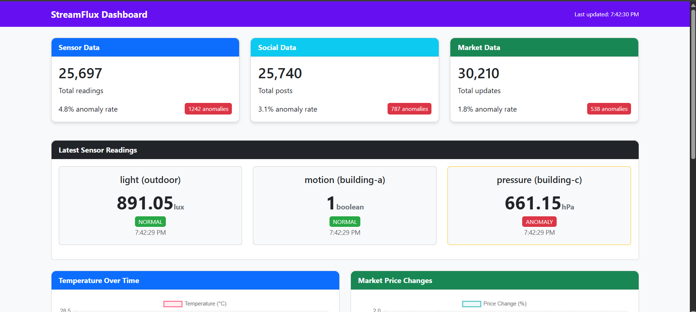
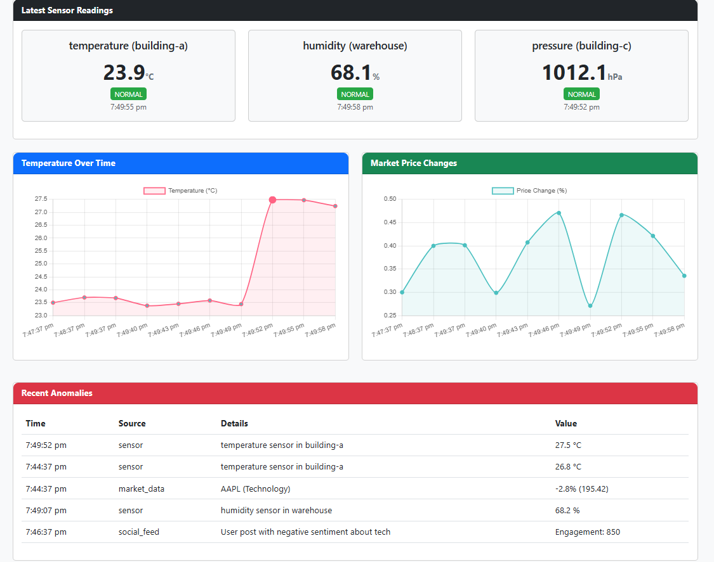

# StreamFlux

A real-time data streaming and anomaly detection system that processes and analyzes data from multiple sources.



## Overview

StreamFlux is a comprehensive data pipeline that simulates, processes, and analyzes streaming data from various sources including IoT sensors, social media, and financial markets. The system automatically detects anomalies in the data stream and provides a REST API for accessing processed data and metrics.

## Features

- **Multi-source Data Simulation**: Generate realistic data for IoT sensors, social media posts, and financial market updates
- **Real-time Anomaly Detection**: Automatically identify unusual patterns and outliers in the data stream
- **Data Storage and Retrieval**: Store processed data in MongoDB for historical analysis
- **REST API**: Access data, metrics, and anomalies through a simple HTTP interface
- **Simplified Architecture**: Runs on a single machine without complex distributed system requirements

## Architecture

The system consists of several components:

1. **Data Producers**: Simulate real-world data sources with configurable parameters
2. **Database Layer**: MongoDB for storing and retrieving data
3. **API Server**: Flask-based REST API for accessing the data
4. **Anomaly Detection**: Statistical algorithms to identify unusual data points

## Getting Started

### Prerequisites

- Python 3.9 or higher
- MongoDB
- Required Python packages (see requirements.txt)

### Installation

1. Clone the repository:
```
git clone https://github.com/yourusername/streamflux.git
cd streamflux
```

2. Create a virtual environment:
```
python -m venv venv
venv\Scripts\activate
```

3. Install dependencies:
```
pip install -r requirements.txt
```

4. Make sure MongoDB is running on your machine.

### Running the Simplified Version

1. Start MongoDB:
```
scripts\start_mongodb.bat
```

2. Run the data producers:
```
python simplified/simplified_producer.py --sensors 5 --users 10 --symbols 20
```

3. Run the API server:
```
python simplified/simplified_api.py
```

4. Access the API at http://localhost:5000/

### API Endpoints

- `/health` - Check system health
- `/metrics` - View data processing metrics
- `/anomalies` - Get detected anomalies
- `/data/<collection>` - Access data from specific collections (sensor_data, social_data, market_data)

## Full Version

The repository also includes a more complex version using Apache Kafka and Apache Spark for distributed processing. See the documentation in the `/docs` folder for details on setting up the full version.

## Use Cases

- Real-time monitoring of IoT sensor networks
- Social media sentiment analysis
- Financial market anomaly detection
- Network traffic analysis
- Industrial equipment monitoring

## Technical Details

- **Languages**: Python
- **Databases**: MongoDB
- **Frameworks**: Flask (API)
- **Algorithms**: Statistical anomaly detection (Z-score, moving averages)

## License

This project is licensed under the MIT License - see the LICENSE file for details.

## Acknowledgments

- Based on modern data engineering practices
- Inspired by real-world streaming architectures at tech companies